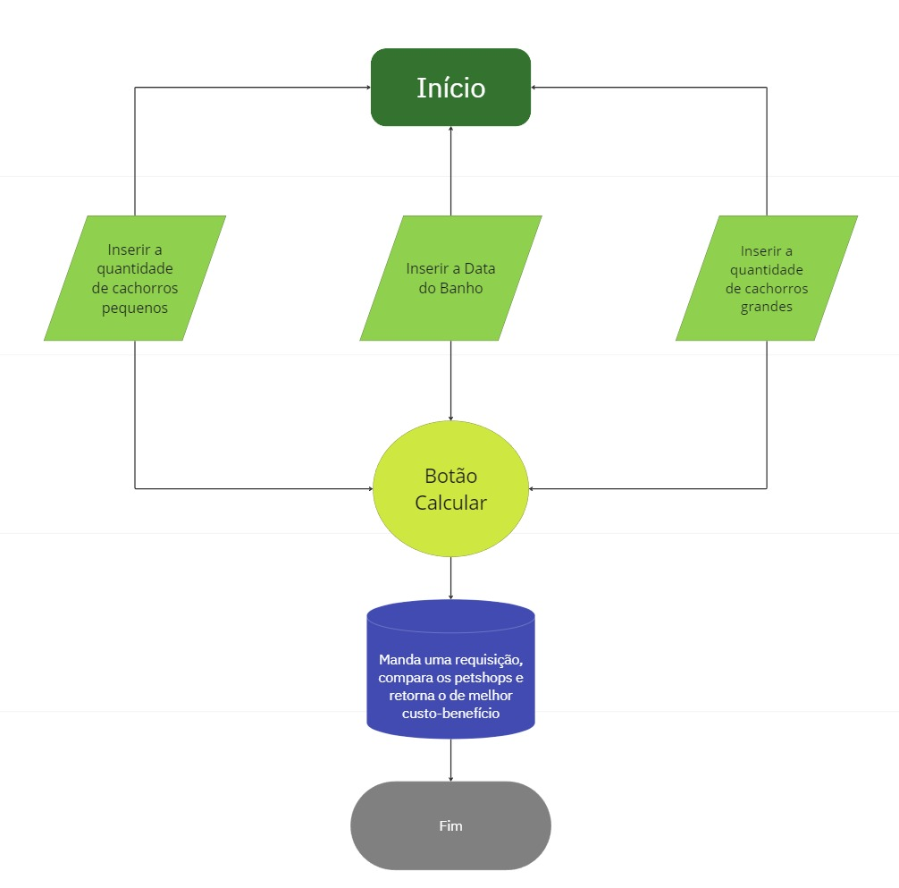

# EconoPet

## Descrição
EconoPet é um sistema para encontrar o melhor petshop com base na data e na quantidade de cachorros pequenos e grandes que você possui. O sistema calcula e apresenta o petshop com o melhor custo benefício.

## Instruções para executar o sistema
1. Certifique-se de ter o Node.js instalado em seu sistema.
2. Clone este repositório em sua máquina local.
3. Abra um terminal na pasta raiz do projeto.
4. Navegue até a pasta `backend` executando o comando `cd backend`.
5. Instale as dependências do backend com o comando `npm install`.
6. Execute o servidor backend com o comando `npm start`.
7. Abra outro terminal na pasta raiz do projeto.
8. Navegue até a pasta `src` executando o comando `cd src`.
9. Instale as dependências do frontend com o comando `npm install`.
10. Execute o servidor de desenvolvimento frontend com o comando `npm start`.
11. Abra um navegador web e acesse [http://localhost:3000](http://localhost:3000) para visualizar o sistema.

## Lista de premissas assumidas
- O sistema é utilizado apenas para encontrar o melhor petshop para cachorros pequenos e grandes.
- Os petshops fornecem serviços com base na data especificada.
- Os petshops possuem custos diferentes para cachorros pequenos e grandes.
- A quantidade de cachorros pequenos e grandes é fornecida pelo usuário.
- Os dados dos petshops são estáticos para fins de demonstração.
- A lógica de cálculo do melhor petshop está correta e reflete a realidade.

## Decisões de projeto
- Utilização de Node.js para o backend e React.js para o frontend devido à facilidade de uso e ampla comunidade de suporte.
- Organização do código em pastas separadas para manter a modularidade e facilitar a manutenção.
- Utilização de Axios para realizar requisições HTTP no frontend para interagir com o backend.
- Utilização de estado local no frontend para gerenciar os dados do formulário e o resultado da busca.
- Separação do código CSS em um arquivo separado para manter uma estrutura de projeto limpa e organizada.
- Utilização de `createRoot` do ReactDOM para renderizar a aplicação React em modo de "concorrente" e prepará-la para recursos futuros de React.

## Considerações e ideias de melhoria
- O sistema é uma versão simplificada e fictícia para fins de demonstração e aprendizado.
- A lógica de cálculo do melhor petshop pode ser expandida e aprimorada com base em requisitos adicionais.
- O sistema pode ser estendido para incluir mais funcionalidades, como autenticação de usuário e armazenamento de dados persistentes.
- Estou aberto a feedbacks e sugestões para melhorias no código e na funcionalidade do sistema.

## Fluxograma da Aplicação

